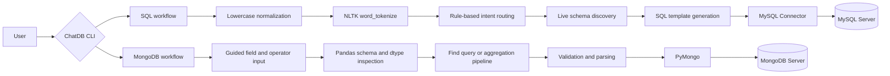

# ChatDB

ChatDB is a lightweight, interpretable NLP-to-database query system. It combines NLTK-based intent routing with schema-aware SQL generation, guided MongoDB query construction, and optional execution against local database servers.

The project uses deterministic rules and structured query templates instead of a trained language model. This makes each step inspectable: users can see how an input is tokenized, how an intent is selected, which schema fields ground the generated query, and what will be executed.

## Highlights

- **NLP intent routing:** normalizes and tokenizes SQL requests with NLTK's `word_tokenize`, then maps keywords to `SELECT`, `GROUP BY`, `WHERE`, or `JOIN`.
- **Interpretable generation:** uses explicit routing rules and query templates, producing outputs that can be reviewed before execution.
- **Schema-aware SQL:** discovers live MySQL databases, tables, columns, and sample rows through `SHOW DATABASES`, `SHOW TABLES`, and `DESCRIBE`.
- **Data-aware MongoDB construction:** uses Pandas column names and data types to guide field selection, value conversion, projections, filters, and aggregation stages.
- **Structured-output guardrails:** quotes discovered MySQL identifiers, performs case-insensitive MongoDB field matching, rejects incompatible numeric comparisons on text fields, maps plain-language operators to MongoDB syntax, and validates generated `find` commands before execution.
- **Dataset-grounded examples:** samples real fields and values from the bundled CSV files to generate MongoDB examples with a description, query, and explanation.
- **End-to-end database integration:** connects generation directly to MySQL through Connector/Python and to MongoDB through PyMongo.

## Architecture



The SQL and MongoDB paths intentionally solve different language-interface problems:

- The **SQL path** uses NLTK tokenization and rule-based NLP to classify a short natural-language request before generating a query from the discovered schema.
- The **MongoDB path** uses a guided conversational flow. It converts user-friendly field, operator, filter, join, grouping, projection, sorting, and limit choices into structured MongoDB syntax.

## Capabilities

### SQL

- List databases available on a MySQL Server.
- Explore tables, column definitions, and sample rows.
- Detect four query intents from tokenized input: `select`, `group by`, `where`, and `join`.
- Populate query templates with tables and columns discovered at runtime.
- Generate a randomly selected query for exploration.
- Review a generated query before choosing whether to execute it.

### MongoDB

- Build `find` queries with one or more filter conditions.
- Map user-facing operators such as `greater than`, `equal to`, `contains`, and `in` to MongoDB operators.
- Combine conditions with `$and` or `$or` and select projected fields.
- Build aggregation pipelines with `$match`, `$lookup`, `$unwind`, `$group`, `$project`, `$sort`, and `$limit`.
- Apply `$sum`, `$avg`, `$min`, and `$max` aggregations.
- Generate dataset-aware `find` and aggregation examples from actual CSV fields and sampled values.
- Parse generated `db.<collection>.find(...)` expressions into validated Python dictionaries before PyMongo execution.

## Technology Stack

| Layer | Technology | Role |
| --- | --- | --- |
| Language | Python 3.11 | CLI, orchestration, query generation, and execution |
| NLP | NLTK | Tokenization for deterministic SQL intent routing |
| Data inspection | Pandas | CSV loading, field discovery, dtype checks, and example sampling |
| Relational database | MySQL Server | Stores relational data and executes generated SQL |
| Relational driver | MySQL Connector/Python | Connects ChatDB directly to MySQL Server |
| Document database | MongoDB Community Server | Stores document collections and executes generated MongoDB queries |
| Document driver | PyMongo | Connects ChatDB directly to MongoDB Server |
| Optional database GUIs | MySQL Workbench and MongoDB Compass | Create, import, browse, and inspect local data |

MySQL Workbench and MongoDB Compass are setup and inspection tools, not runtime dependencies. ChatDB connects directly to the database servers through the Python drivers. In the MongoDB workflow, Compass can be used to create collections, import the CSV files, and inspect the resulting documents; ChatDB continues to work when Compass is closed as long as MongoDB Server is running.

## Getting Started

### 1. Prerequisites

- Python 3.11
- MySQL Server for the SQL workflow
- MongoDB Community Server for the MongoDB workflow
- MySQL Workbench, optional
- MongoDB Compass, optional

You can run either database workflow independently, but its corresponding server must be installed, configured, and running.

### 2. Install Python dependencies

```bash
git clone https://github.com/HerryW0108/ChatDB.git
cd ChatDB

python3 -m venv .venv
source .venv/bin/activate
python -m pip install --upgrade pip
python -m pip install -r requirements.txt
```

On Windows PowerShell, activate the environment with:

```powershell
.\.venv\Scripts\Activate.ps1
```

### 3. Install the NLTK tokenizer data

ChatDB preserves the original NLTK `word_tokenize()` pipeline. Install both Punkt resources so the tokenizer works across NLTK releases:

```bash
python -m nltk.downloader punkt punkt_tab
```

This is a one-time download for each Python environment.

### 4. Configure database connections

ChatDB reads connection settings from environment variables and uses the following local defaults:

| Variable | Default |
| --- | --- |
| `MYSQL_HOST` | `localhost` |
| `MYSQL_PORT` | `3306` |
| `MYSQL_USER` | `root` |
| `MYSQL_PASSWORD` | empty |
| `MONGODB_URI` | `mongodb://localhost:27017/` |
| `MONGODB_DATABASE` | `demo` |

The included `.env.example` is a configuration reference. The application reads process environment variables, so export the values in your shell before launch. For example:

```bash
export MYSQL_HOST=localhost
export MYSQL_PORT=3306
export MYSQL_USER=root
export MYSQL_PASSWORD='your-mysql-password'
export MONGODB_URI='mongodb://localhost:27017/'
export MONGODB_DATABASE=demo
```

Alternatively, copy `.env.example` to the ignored `.env` file, edit it, and load it into a POSIX shell before running ChatDB:

```bash
cp .env.example .env
set -a
source .env
set +a
```

## Database Setup

### MySQL Server

MySQL Server is required for SQL query execution. MySQL Workbench is optional, but its Table Data Import Wizard is the simplest way to reproduce the bundled relational setup.

1. Install MySQL Server, start it, and confirm that you can connect with the credentials configured above.
2. Open MySQL Workbench and connect to the local server, or open the MySQL command-line client.
3. Create the three demonstration databases:

   ```sql
   CREATE DATABASE IF NOT EXISTS qualifiers;
   CREATE DATABASE IF NOT EXISTS results;
   CREATE DATABASE IF NOT EXISTS standings;
   ```

4. In MySQL Workbench, right-click each schema and choose **Table Data Import Wizard**. Import the CSV files with their first row treated as column names:

   | Database | CSV file | Suggested table name |
   | --- | --- | --- |
   | `qualifiers` | `qualifying.csv` | `qualifying` |
   | `results` | `constructorResults.csv` | `constructorResults` |
   | `standings` | `constructorStandings.csv` | `constructorStandings` |

   The bundled `qualifying.csv` is preserved byte-for-byte and includes fully empty trailing CSV records. Omit those empty records during import if Workbench displays them; keep the repository file unchanged.

5. Review the inferred column types in the wizard, complete the import, and verify that each table contains rows.

The SQL workflow is not hard-coded to these names. It discovers the databases and tables exposed by the connected server, so it can also explore another schema that your MySQL user can access.

### MongoDB Server

MongoDB Community Server is required for MongoDB query execution. The default configuration expects a local server at `mongodb://localhost:27017/` and a database named `demo`.

#### Import with MongoDB Compass

1. Install and start MongoDB Community Server.
2. Open Compass and connect to `mongodb://localhost:27017/`.
3. Create a database named `demo` and an initial collection named `usercuisine`.
4. Open the collection, choose **Add Data > Import JSON or CSV**, select `usercuisine.csv`, and import it as CSV. In **Specify Fields and Types**, keep `userID` and `Rcuisine` as strings.
5. Create and import the remaining two collections with these exact mappings:

   | CSV file | Collection |
   | --- | --- |
   | `userpayment.csv` | `userpayment` |
   | `userprofile.csv` | `userprofile` |

6. During the `userprofile.csv` import, keep categorical fields, including `smoker`, as strings. Set `latitude`, `longitude`, and `height` to a floating-point numeric type, and set `birth_year` and `weight` to an integer type. These BSON types match the local Pandas view used by the generator and allow numeric comparisons and aggregations to execute as intended.
7. Confirm in Compass that each collection contains documents.

Compass is used here as a GUI for setup and inspection. The application itself connects to MongoDB Server through PyMongo.

#### Import with `mongoimport`

If MongoDB Database Tools are installed, the same three collections can be created from a macOS or Linux terminal. These commands skip the CSV header and declare BSON field types explicitly:

```bash
tail -n +2 usercuisine.csv | mongoimport \
  --uri "mongodb://localhost:27017/demo" \
  --collection usercuisine --type csv --columnsHaveTypes \
  --fields 'userID.string(),Rcuisine.string()'

tail -n +2 userpayment.csv | mongoimport \
  --uri "mongodb://localhost:27017/demo" \
  --collection userpayment --type csv --columnsHaveTypes \
  --fields 'userID.string(),Upayment.string()'

tail -n +2 userprofile.csv | mongoimport \
  --uri "mongodb://localhost:27017/demo" \
  --collection userprofile --type csv --columnsHaveTypes \
  --fields 'userID.string(),latitude.double(),longitude.double(),smoker.string(),drink_level.string(),dress_preference.string(),ambience.string(),transport.string(),marital_status.string(),hijos.string(),birth_year.int32(),interest.string(),personality.string(),religion.string(),activity.string(),color.string(),weight.int32(),budget.string(),height.double()'
```

If you change the database name, set `MONGODB_DATABASE` to the same value before launch.

## Run ChatDB

Start the unified CLI:

```bash
python main.py
```

The landing menu routes to either database workflow:

```text
Welcome to ChatDB!
1. Explore SQL databases
2. Explore MongoDB
3. Exit
```

In the SQL workflow, explore a database first so ChatDB can load its live table metadata. You can then describe a query category, for example:

```text
I want a GROUP BY query
```

NLTK tokenizes the normalized request, the rule-based router detects the `group` intent, and ChatDB selects the corresponding schema-aware SQL template. A representative generated result is:

```sql
SELECT `constructorId`, SUM(`points`)
FROM `constructorResults`
GROUP BY `constructorId`;
```

In the MongoDB workflow, enter `find`, `aggregate`, or `example`. A guided `find` session can produce:

```javascript
db.usercuisine.find(
  {"Rcuisine": "American"},
  {"userID": 1, "Rcuisine": 1}
)
```

A guided aggregation session can build a multi-stage pipeline such as:

```javascript
db.userprofile.aggregate([
  {"$group": {
    "_id": "$budget",
    "average_height": {"$avg": "$height"}
  }},
  {"$project": {
    "_id": 0,
    "budget": "$_id",
    "average_height": "$average_height"
  }},
  {"$sort": {"average_height": -1}},
  {"$limit": 3}
])
```

Generated fields, values, and query shapes can vary because the SQL random-query mode and MongoDB example generator intentionally sample from the available schema and data. ChatDB always displays generated code before asking whether to execute it.

## Testing

After installing the dependencies and NLTK resources, run the complete test suite with:

```bash
python -m unittest discover -s tests -v
```

The tests cover NLP intent routing, reserved-word-safe MySQL generation, environment-based MySQL configuration, validated MongoDB `find` parsing and dispatch, application menu routing, CSV loading from outside the project directory, and byte-for-byte integrity checks for every bundled dataset.

## Bundled Data

| File | Workflow | Contents |
| --- | --- | --- |
| `qualifying.csv` | MySQL | Qualifying results and lap-time fields |
| `constructorResults.csv` | MySQL | Constructor results, points, and status fields |
| `constructorStandings.csv` | MySQL | Constructor standings, positions, wins, and related fields |
| `usercuisine.csv` | MongoDB | User-to-cuisine preferences |
| `userpayment.csv` | MongoDB | User payment preferences |
| `userprofile.csv` | MongoDB | User profile, preference, location, and demographic fields |

The CSV files are used both as import sources and, in the MongoDB workflow, as local schema and value references for query construction and example generation.

## Project Structure

```text
ChatDB/
|-- tests/                 # NLP, database-boundary, CLI, and data-integrity tests
|-- main.py                 # Application entry point
|-- landing_page.py         # Unified SQL/MongoDB menu
|-- SQL.py                  # NLTK routing, SQL generation, and MySQL execution
|-- MongoDB_Final.py        # Guided MongoDB generation and dataset-aware examples
|-- Mongo_execution.py      # Validated parsing and PyMongo execution
|-- requirements.txt        # Python dependencies
|-- .env.example            # Connection-setting reference
|-- .gitattributes          # Preserves the bundled CSV bytes in Git
|-- qualifying.csv
|-- constructorResults.csv
|-- constructorStandings.csv
|-- usercuisine.csv
|-- userpayment.csv
`-- userprofile.csv
```

## Design Boundaries

ChatDB is an interpretable, rule-based prototype rather than a general-purpose language model.

- SQL intent detection is keyword-based and supports four query categories; it does not infer unrestricted SQL from arbitrary prose.
- The MongoDB path is a guided query composer, not an NLTK or model-based intent classifier.
- SQL table and column selection is schema-aware, but randomized templates do not reason about semantic relationships between columns. Review generated `JOIN`, aggregation, and filter logic before execution.
- MongoDB validation covers supported fields, operators, types, and generated `find` syntax, but it is not a full MongoDB query-language parser.
- The bundled workflows target local MySQL and MongoDB services and do not include hosting, authentication management, or a production API.

These constraints are deliberate: the project emphasizes transparent NLP preprocessing, constrained structured generation, schema grounding, validation, and executable database integration.

## Contributors

- Herry Wang
- Fiona Chen
- Kai Shun Lee
